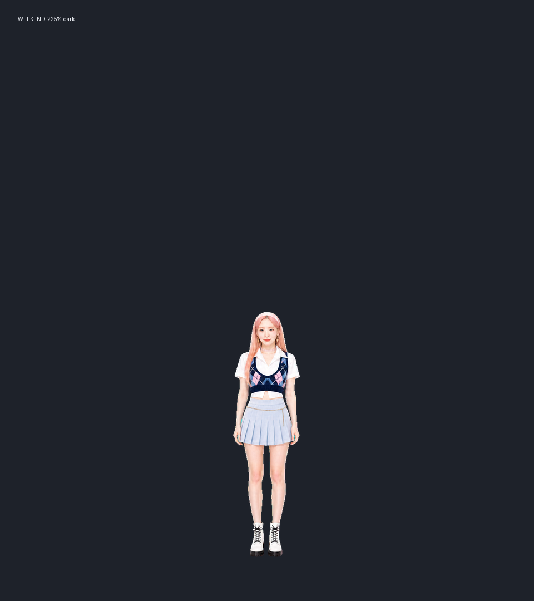

# 小泰妍

开发者：个人非商业开发

版本：1.1.1

互动角色：金泰妍

这是一个 Windows 单文件互动角色项目。**Weekend 粉蓝周末**和 **INVU 月影女神**两套造型、各自完整动作帧与运动网格都已编译进同一个 `小泰妍.exe`。不需要 `skins` 文件夹，也不需要运行第二个 EXE。造型仅参考公开可见舞台图片，以非官方、非商业的数字化演绎重新制作；公开照片不会打包进 EXE。

## 预览

| Weekend 粉蓝周末 | INVU 月影女神 |
| --- | --- |
|  |  |

## 两套皮肤

- `built-in`：Weekend 粉蓝周末（内置），r15 专属动作为“粉蓝周末星光亮相”。
- `taeyeon-invu`：INVU 月影女神（内置），r15 专属动作为“月影侧身行礼”。

运行后右键角色，打开“皮肤”，即可在上述两项之间直接切换。程序使用人物轮廓旋身与由头到脚的变装过渡；切换完成后会保存选择，下次启动继续使用上次的皮肤。

两套皮肤共享同一份固定动作契约：24 行、176 张 `528×808` RGBA 关键帧。皮肤只替换画面，不改变状态机、动作顺序、触发条件、播放时长、随机权重、运行时插值、QA 或安全校验。

## 互动功能

- 左键拖动；越过拖拽阈值后受惊，松手后生气跺脚。
- 双击挥手，滚轮缩放，近距离鼠标视线跟随。
- 右键预览动作、切换皮肤、调整大小、置顶、暂停或退出。
- 随机待机、坐下玩手机、侧躺入睡及点击唤醒。
- 切换皮肤时使用 60 阶段人物 alpha 切片伪 3D 旋身、由头到脚变装并原子替换缓存。
- 每个完整动画循环至少 24 个显示阶段，沿用固定基线节奏。
- 可选“公开动态提醒”沿用基线开关与低频轮询行为，检查预配置的金泰妍相关新浪公开页面；可随时在右键菜单关闭。
- “立即检查公开动态”下方提供“开机自启”，只写入当前 Windows 用户的启动项，可随时取消。

## 下载与使用

请在仓库的 [Releases](https://github.com/super-idol-hub/xiaotaiyan/releases/latest) 页面下载：

- `XiaoTaeyeon-v1.1.1-full.zip`：推荐，包含主程序、使用说明和 SHA-256 校验值。
- `XiaoTaeyeon-v1.1.1.exe`：单独的主程序。

下载后解压 ZIP，运行 `小泰妍.exe`。Windows 首次运行若显示来源提示，请先核对 Release 页面公布的 SHA-256，再按系统提示选择是否运行。

## 文件夹

- `source/standalone/xiaoxiwei/`：运行时源码与构建脚本；该目录名为基线兼容路径，不代表产品名称。
- `docs/`：使用说明、动作与素材说明、皮肤包接口。
- `qa/evidence/`：交互、尺寸、换肤和双内置皮肤验证证据。
- `skin-pack-template/`：可选第三方皮肤包模板。

高清成品、用户参考照片、生成中间图和构建缓存不提交到源码仓库。`build.ps1` 会将已验证的 Weekend 与 INVU 归档作为两个程序集资源链接进同一个 EXE；完整复现构建需要自行准备符合文档约定的两套帧归档。

## 公开动态提醒

此功能是低频、尽力而为的公开页面检查器，不是艺人官方消息源，也不承诺实时性或长期可用性。首次检查只建立本地基线；断网、超时和页面格式变化会静默退避。程序不硬编码 Cookie、AppSecret 或用户凭据，也不保存完整时间线。

## 技术基础

项目在 [super-idol-hub/xiaoxiwei](https://github.com/super-idol-hub/xiaoxiwei) 的 Windows 透明角色运行时基础上开发，保留 24 行、176 帧动作契约、单主体运动网格补间、拖拽与待机状态机、换肤预热和安全校验；角色造型、产品身份、内置皮肤资源、动作画面与发行包均为小泰妍项目独立内容。

## 免责声明

本项目由个人非商业开发，仅供粉丝个人欣赏、学习与交流。人物姓名、肖像、公开活动素材、节目名称、音乐作品及相关知识产权归金泰妍本人和各自权利方所有。本项目为非官方作品，与金泰妍本人、其工作室、经纪机构、节目制作方、平台或品牌无隶属、授权、代言或合作关系。

禁止售卖、收费分发、广告引流、商业推广、二次商用、冒用官方名义，或用于侵犯肖像权、名誉权及其他合法权益。程序不内置歌曲、节目原声、台词、视频片段或网页原图。若权利方认为内容不妥，请停止传播并联系维护者处理。
